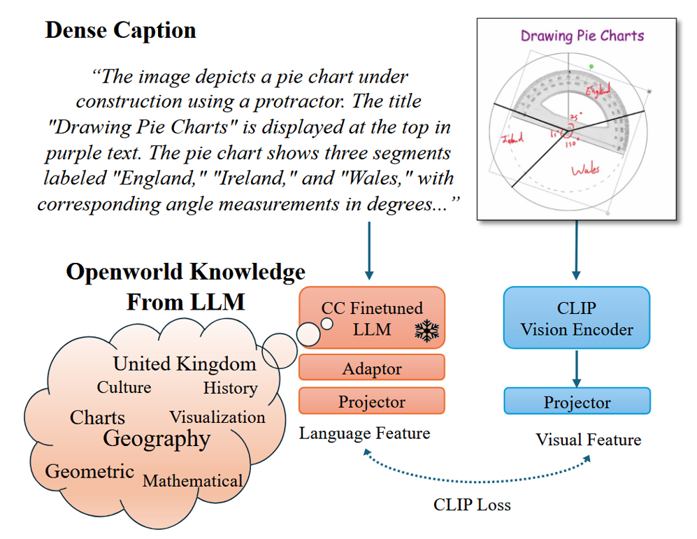
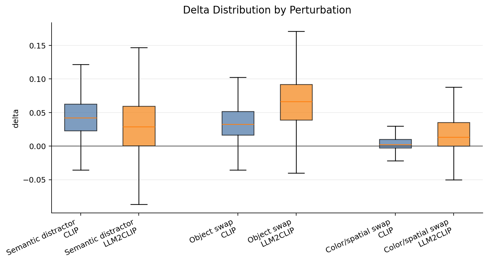

# CLIP vs. LLM2CLIP — Semantic Perturbation Sensitivity

Are vision-language models that score higher on standard retrieval benchmarks actually *better* at the fine-grained
semantics of a caption — the objects, colors, and spatial relations it describes? This project measures how sensitive
**CLIP** (`openai/clip-vit-large-patch14-336`) and **LLM2CLIP** (`microsoft/LLM2CLIP-Openai-L-14-336` +
`microsoft/LLM2CLIP-Llama-3-8B-Instruct-CC-Finetuned`) are to controlled semantic corruptions of MSCOCO captions.

## What is LLM2CLIP?

[**LLM2CLIP**](https://github.com/microsoft/LLM2CLIP) (Huang et al., 2024) replaces CLIP's lightweight text encoder with a large language model, so caption understanding is driven by an LLM (Llama-3-8B) instead of CLIP's ~123M text tower. It is trained in two stages:

<p align="center">
  
</p>

1. **Caption-contrastive LLM fine-tuning (Stage 1)** — turn an LLM into a caption embedding model via the LLM2Vec recipe (LoRA + mean pooling + bidirectional attention + supervised SimCSE on caption pairs).
2. **Vision adaptation (Stage 2)** — the fine-tuned LLM (frozen) replaces CLIP's text encoder; a lightweight adaptor maps its features into the CLIP space, and the vision encoder + adaptor are fine-tuned with the CLIP contrastive loss.

This project **evaluates** the released checkpoints — it does not train them.

## Method

For each image–caption pair:

```text
delta = cosine(image_emb, text_emb(original_caption)) - cosine(image_emb, text_emb(corrupted_caption))
```

A larger `delta` means the corruption lowered image–text similarity (the model noticed the change); `positive_rate` is the fraction of pairs with `delta > 0`. Three perturbations are applied to each caption:

| Type | How it's built |
|---|---|
| **Object swap** | Replace a core object word, e.g. `horse → bicycle`, `dog → cat` |
| **Color / spatial swap** | Replace a color word (`red → blue`) or spatial relation (`on → under`, `left of → right of`) |
| **Semantic distractor** | Append another image's unrelated caption, wrapped in one of 5 instruction templates that label the relevant/irrelevant sentences |

## Results (MSCOCO 2014, 5k split)

| Model | Perturbation | n | delta_mean | positive_rate |
|---|---|---:|---:|---:|
| CLIP | Semantic distractor | 25010 | 0.0439 | 0.939 |
| LLM2CLIP | Semantic distractor | 25010 | 0.0302 | 0.750 |
| CLIP | Object swap | 14233 | 0.0356 | 0.939 |
| LLM2CLIP | Object swap | 14233 | 0.0671 | 0.950 |
| CLIP | Color/spatial swap | 18131 | 0.0057 | 0.629 |
| LLM2CLIP | Color/spatial swap | 18131 | 0.0210 | 0.753 |

Clean-caption baseline cosine: CLIP **0.2635** vs LLM2CLIP **0.2817**.

<p align="center">
  
</p>

### Findings

The headline result is a desirable **robustness profile**: LLM2CLIP is *more tolerant of irrelevant noise* yet *more sensitive to meaningful semantic changes* than CLIP.

- **Tolerant of irrelevant noise — semantic distractors.** When an unrelated caption is appended *with explicit "ignore"/"unrelated" labelling*, CLIP's similarity drops more (Δ 0.044 vs 0.030; 94% vs 75% of pairs affected). LLM2CLIP better preserves the target caption's similarity — it leverages the template cues ("unrelated description", "ignore the following") to filter out the irrelevant text, which CLIP's encoder cannot.
- **Sensitive to meaningful changes — object & color/spatial swaps.** On object swaps LLM2CLIP's similarity drops about double (Δ 0.067 vs 0.036; both models notice it ~94–95% of the time). On color/spatial swaps it also drops more (0.021 vs 0.006), but in absolute terms *both* deltas are tiny (CLIP's 25th-percentile Δ ≤ 0) — fine-grained attribute/spatial reasoning remains a shared weak spot.
- **Higher clean alignment.** LLM2CLIP's image–caption cosine sits higher out of the box (0.282 vs 0.264), so it starts from a better-aligned embedding space.

Full numbers: [`summary.csv`](outputs/semantic_perturbation_eval/summary.csv) · full figure set: [`figures_v2/`](outputs/semantic_perturbation_eval/figures_v2/) · write-ups: [`report.md`](outputs/semantic_perturbation_eval/report.md), [`docs/report_zh.md`](docs/report_zh.md).

### Limitations & next steps

- **Different subsets per perturbation.** Object / color-spatial swaps apply only where a dictionary word matches (coverage 57% / 72%; distractor 100%), so each is scored on a different caption set. *Within-perturbation* CLIP-vs-LLM2CLIP comparisons use identical caption sets (the headline); *across-perturbation* comparisons are qualitative.
- **Sensitivity, not retrieval.** `delta` is a per-pair semantic-sensitivity probe, not Recall@1/5/10. Adding distractor-pool retrieval is listed future work.
- **Raw deltas, not normalized.** The two models sit on different similarity scales (clean baseline 0.264 vs 0.282), so deltas are compared as raw values; the *direction* of every comparison holds under relative-drop normalization, but precise multiples (e.g. "1.9×") are scale-dependent and meant qualitatively.
- **Not size-controlled.** LLM2CLIP's text tower is Llama-3-8B (~8B params) vs CLIP's ~123M — this is a characterization study, not a fair architecture comparison.
- **Lexicon.** Swaps use a hand-curated, English-only dictionary and replace only the first match per caption; POS-tag-driven / LLM-generated swaps are future work.

## Repository layout

```
llm2clip-perturbation/
├── scripts/     # build_caption_perturbations · evaluate_semantic_perturbations · make_report · plot_figures
├── outputs/     # committed results: CSVs, figures/, figures_v2/, summary, report.md
├── docs/        # framework figure, PDF report + slides, detailed Chinese analysis
├── datasets/    # NOT committed — download locally
└── models/      # NOT committed — download locally
```

## Reproduce

Requires **Python 3.10** + a CUDA GPU (the LLM2CLIP-Llama-3-8B text encoder needs ~16 GB VRAM, or use `--llm-load-in-4bit`).

```bash
pip install torch --index-url https://download.pytorch.org/whl/cu121   # match your CUDA build first
pip install -r requirements.txt
```

**Data & models** are gitignored. Download the [MSCOCO 2014 5k retrieval split](https://huggingface.co/datasets/MMInstruction/MSCOCO_2014_5k_test_image_text_retrieval) and the checkpoints — [CLIP-L/14-336](https://huggingface.co/openai/clip-vit-large-patch14-336), [LLM2CLIP-Openai-L-14-336](https://huggingface.co/microsoft/LLM2CLIP-Openai-L-14-336), [LLM2CLIP-Llama-3-8B-Instruct-CC-Finetuned](https://huggingface.co/microsoft/LLM2CLIP-Llama-3-8B-Instruct-CC-Finetuned), [LLM2Vec-Meta-Llama-3-8B-Instruct-mntp](https://huggingface.co/McGill-NLP/LLM2Vec-Meta-Llama-3-8B-Instruct-mntp) (base text-encoder weights) — under `datasets/` and `models/`, or override every path with CLI flags. (The LLM2CLIP evaluator loads its image processor from the CLIP model dir, overridable via `--clip-model-path`.)

```bash
python scripts/build_caption_perturbations.py            # 1. build perturbations (CPU)
python scripts/evaluate_semantic_perturbations.py --model both   # 2. evaluate (GPU; --limit 50 to smoke-test)
python scripts/make_semantic_perturbation_report.py      # 3. summary + figures/ + report.md
python scripts/plot_semantic_perturbation_figures.py     # 4. focused figures_v2/ set
```

## Further reading

[`docs/`](docs/) contains `llm2clip_report.pdf` and `presentation.pdf`; see also [`report.md`](outputs/semantic_perturbation_eval/report.md) and [`docs/report_zh.md`](docs/report_zh.md).

## License

[MIT](LICENSE).
