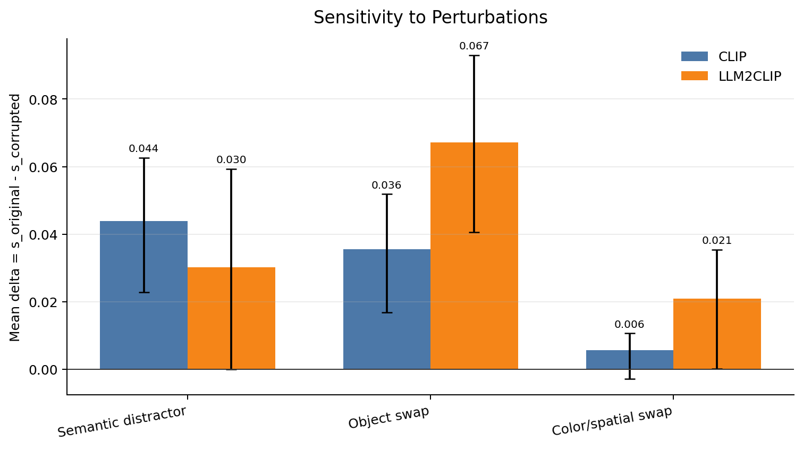
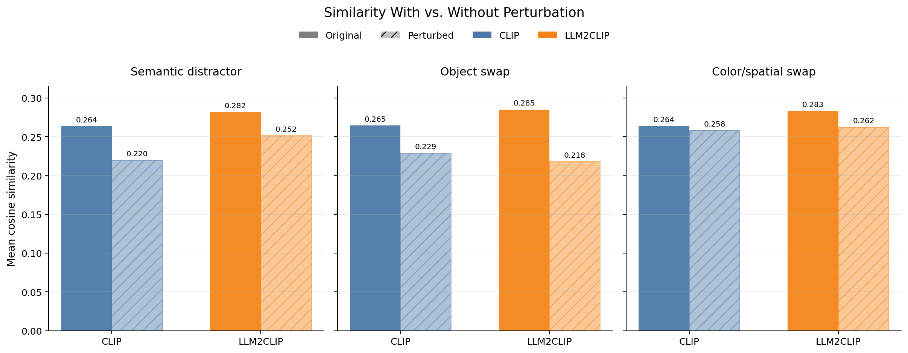
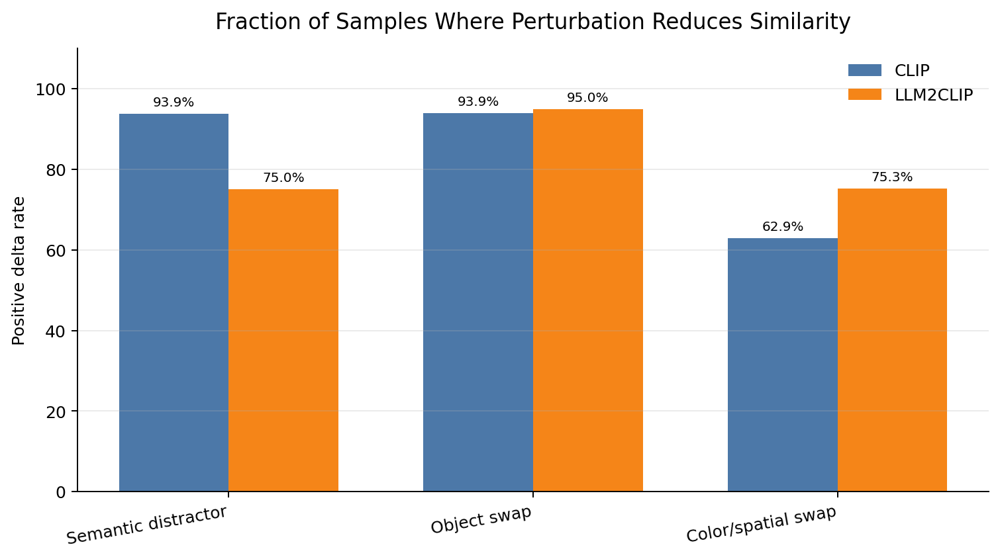

# CLIP vs. LLM2CLIP — Semantic Perturbation Sensitivity

Are vision-language models that score higher on standard retrieval benchmarks actually *better* at the fine-grained
semantics of a caption — the objects, colors, and spatial relations it describes? This project measures how sensitive
**CLIP** (`openai/clip-vit-large-patch14-336`) and **LLM2CLIP** (`microsoft/LLM2CLIP-Openai-L-14-336` +
`microsoft/LLM2CLIP-Llama-3-8B-Instruct-CC-Finetuned`) are to controlled semantic corruptions of MSCOCO captions.

<p align="center">
  
</p>

For each image–caption pair we compute:

```text
delta = cosine(image_emb, text_emb(original_caption)) - cosine(image_emb, text_emb(corrupted_caption))
```

A larger `delta` means the corruption lowered image–text similarity — i.e. the model noticed the semantic change.
`positive_rate` is the fraction of pairs where `delta > 0`.

## Results (MSCOCO 2014, 5k split)

| Model | Perturbation | n | delta_mean | positive_rate |
|---|---|---:|---:|---:|
| CLIP | Semantic distractor | 25010 | 0.0439 | 0.939 |
| LLM2CLIP | Semantic distractor | 25010 | 0.0302 | 0.750 |
| CLIP | Object swap | 14233 | 0.0356 | 0.939 |
| LLM2CLIP | Object swap | 14233 | 0.0671 | 0.950 |
| CLIP | Color/spatial swap | 18131 | 0.0057 | 0.629 |
| LLM2CLIP | Color/spatial swap | 18131 | 0.0210 | 0.753 |

Clean-caption baseline cosine (`s_original_mean`): CLIP **0.2635** vs LLM2CLIP **0.2817**.

<p align="center">
  
</p>

<p align="center">
  
</p>

### Findings

- **Clean alignment is stronger for LLM2CLIP.** Its image–caption cosine sits higher out of the box (0.282 vs 0.264), so it starts from a better-aligned embedding space.
- **Object swaps are the cleanest signal.** Both models notice an object swap most of the time (positive-rate 0.94 / 0.95), but LLM2CLIP's similarity drops **~1.9× more** (Δ 0.067 vs 0.036) — sharper object-level semantics. Large *n* and high positive-rate on both sides make this the most defensible result.
- **Color/spatial swaps are hard for both.** CLIP barely moves (Δ 0.006, positive-rate 0.63 — its 25th-percentile `delta` is ≤ 0). LLM2CLIP still responds ~3.7× more in relative terms (Δ 0.021, positive-rate 0.75), but in absolute terms both are near the floor: fine-grained attribute/spatial reasoning is the shared weak spot.
- **Semantic distractors flip the picture.** When an unrelated caption is appended *with explicit "ignore"/"unrelated" labelling*, CLIP's similarity drops **more** (Δ 0.044 vs 0.030; 94% vs 75% of pairs affected). LLM2CLIP better preserves the target caption's similarity — evidence it exploits the natural-language instructions that CLIP's encoder cannot.

Full numbers: [`summary.csv`](outputs/semantic_perturbation_eval/summary.csv) · delta distribution & per-template breakdown: [`figures_v2/`](outputs/semantic_perturbation_eval/figures_v2/) · write-ups: [`report.md`](outputs/semantic_perturbation_eval/report.md), [`docs/report_zh.md`](docs/report_zh.md) (中文).

### Limitations & next steps

- **Different subsets per perturbation.** Object / color-spatial swaps apply only where a dictionary word matches (coverage 57% / 72%; distractor 100%), so each is scored on a different caption set. *Within-perturbation* CLIP-vs-LLM2CLIP comparisons use identical caption sets (the headline); *across-perturbation* comparisons are qualitative.
- **Sensitivity, not retrieval.** `delta` is a per-pair semantic-sensitivity probe, not Recall@1/5/10. Adding distractor-pool retrieval is listed future work.
- **Not size-controlled.** LLM2CLIP's text tower is Llama-3-8B (~8B params) vs CLIP's ~123M — this is a characterization study, not a fair architecture comparison.
- **Lexicon.** Swaps use a hand-curated, English-only dictionary and replace only the first match per caption; POS-tag-driven / LLM-generated swaps are future work.

## Repository layout

```
llm2clip-perturbation/
├── README.md
├── LICENSE
├── requirements.txt
├── docs/                       # PDF report, slides, and the detailed Chinese analysis
├── scripts/                    # the experiment pipeline (4 scripts)
│   ├── build_caption_perturbations.py
│   ├── evaluate_semantic_perturbations.py
│   ├── make_semantic_perturbation_report.py
│   └── plot_semantic_perturbation_figures.py
├── outputs/                    # committed results: CSVs, figures/, figures_v2/, summary
├── datasets/                   # NOT committed — download locally (see below)
└── models/                     # NOT committed — download locally (see below)
```

## Setup

Requires **Python 3.10** and a CUDA GPU. The CLIP runs are light; the LLM2CLIP-Llama-3-8B text encoder needs
roughly 16 GB+ of VRAM (use `--llm-load-in-4bit` to fit on less).

```bash
# 1. torch first (pick the build matching your CUDA version):
pip install torch --index-url https://download.pytorch.org/whl/cu121

# 2. everything else:
pip install -r requirements.txt
```

### Data & models (not committed)

The scripts default to local paths under `datasets/` and `models/`. Download them so the layout matches the defaults,
or override every path with CLI flags.

**Dataset** — MSCOCO 2014 5k image-text retrieval split ([`MMInstruction/MSCOCO_2014_5k_test_image_text_retrieval`](https://huggingface.co/datasets/MMInstruction/MSCOCO_2014_5k_test_image_text_retrieval)):

```
datasets/mscoco_2014_5k_test_image_text_retrieval/
├── test_5k_mscoco_2014.csv
└── images_mscoco_2014_5k_test/        # extracted from images_mscoco_2014_5k_test.zip
```

**Models** ([`openai/clip-vit-large-patch14-336`](https://huggingface.co/openai/clip-vit-large-patch14-336),
[`microsoft/LLM2CLIP-Openai-L-14-336`](https://huggingface.co/microsoft/LLM2CLIP-Openai-L-14-336),
[`microsoft/LLM2CLIP-Llama-3-8B-Instruct-CC-Finetuned`](https://huggingface.co/microsoft/LLM2CLIP-Llama-3-8B-Instruct-CC-Finetuned),
[`McGill-NLP/LLM2Vec-Meta-Llama-3-8B-Instruct-mntp`](https://huggingface.co/McGill-NLP/LLM2Vec-Meta-Llama-3-8B-Instruct-mntp) as the base text encoder weights):

```
models/clip-vit-large-patch14-336/
models/LLM2CLIP-Openai-L-14-336/
models/LLM2CLIP-Llama-3-8B-Instruct-CC-Finetuned/
models/LLM2Vec-Meta-Llama-3-8B-Instruct-mntp/
```

> Note: the LLM2CLIP evaluator loads its image processor from the local CLIP model dir (LLM2CLIP reuses the standard
> CLIP image preprocessor); the path is overridable via `--clip-model-path`. Keep that folder present by default.

## Pipeline

Run from the repo root. Steps 1, 3, 4 are CPU-only and fast; step 2 is the GPU evaluation.

```bash
# 1. Build the perturbation sets from the MSCOCO captions.
python scripts/build_caption_perturbations.py

# 2. Evaluate CLIP and/or LLM2CLIP. Use --limit N for a quick smoke test.
python scripts/evaluate_semantic_perturbations.py --model both
#   e.g. quick CLIP-only test:
#   python scripts/evaluate_semantic_perturbations.py --model clip --limit 50 --skip-original-caption

# 3. Generate the summary table, figures/, and English report.md.
python scripts/make_semantic_perturbation_report.py

# 4. Generate the focused figures_v2/ set (boxplots, per-template breakdown).
python scripts/plot_semantic_perturbation_figures.py
```

### Perturbation types

| Type | How it's built |
|---|---|
| **Object swap** | Replace a core object word, e.g. `horse → bicycle`, `dog → cat` |
| **Color / spatial swap** | Replace a color word (`red → blue`) or spatial relation (`on → under`, `left of → right of`) |
| **Semantic distractor** | Append another image's unrelated caption, wrapped in one of 5 instruction templates that label the relevant/irrelevant sentences |

## More results & figures

- [`figures_v2/`](outputs/semantic_perturbation_eval/figures_v2/) — sensitivity, before/after similarity, positive-delta rate, delta distribution, per-template breakdown
- [`report.md`](outputs/semantic_perturbation_eval/report.md) — generated English report
- [`docs/`](docs/) — `llm2clip_report.pdf`, `presentation.pdf`, and the detailed [`report_zh.md`](docs/report_zh.md)

## License

[MIT](LICENSE).
