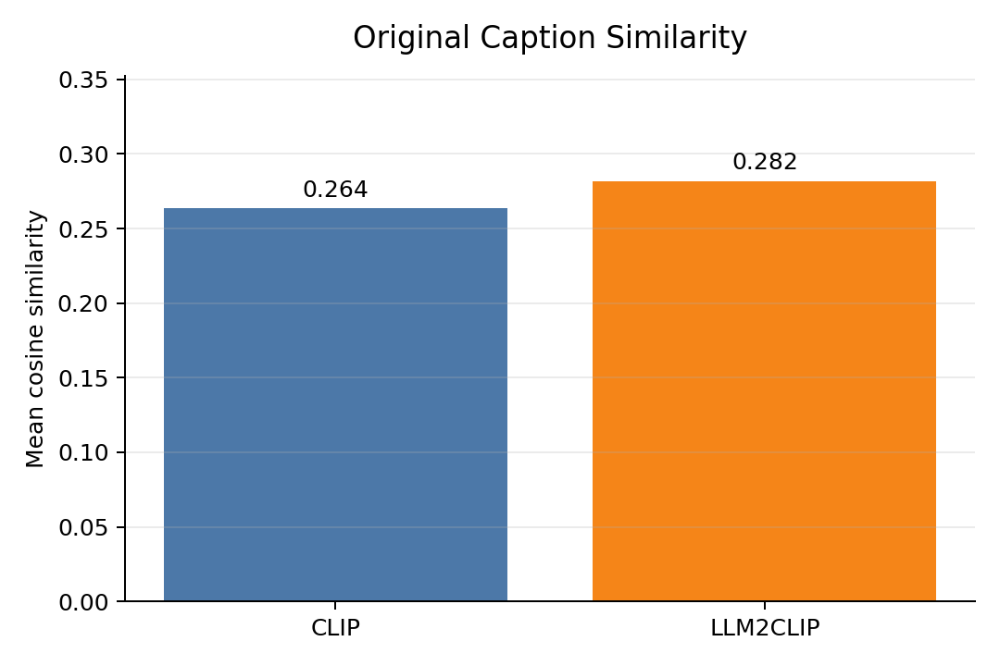
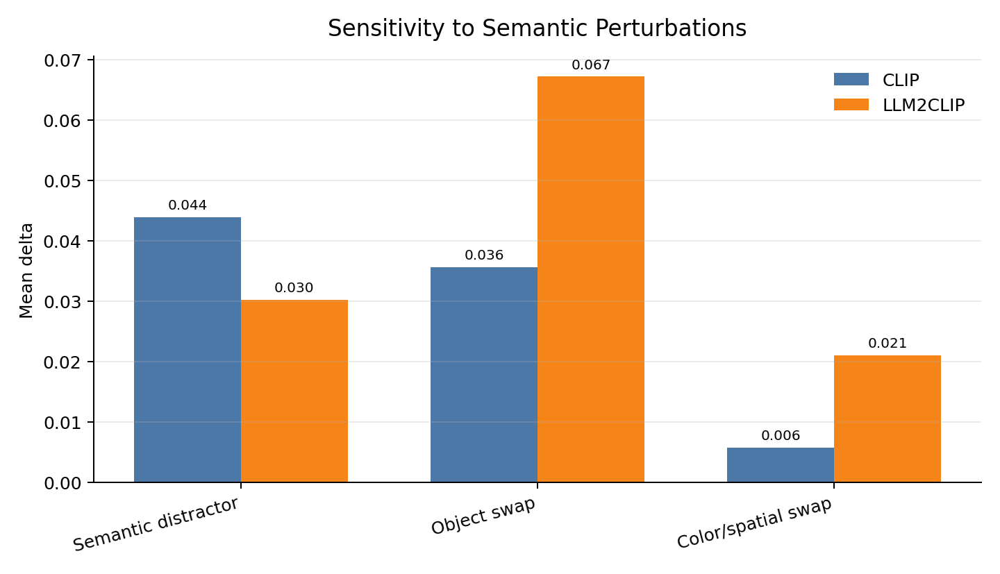
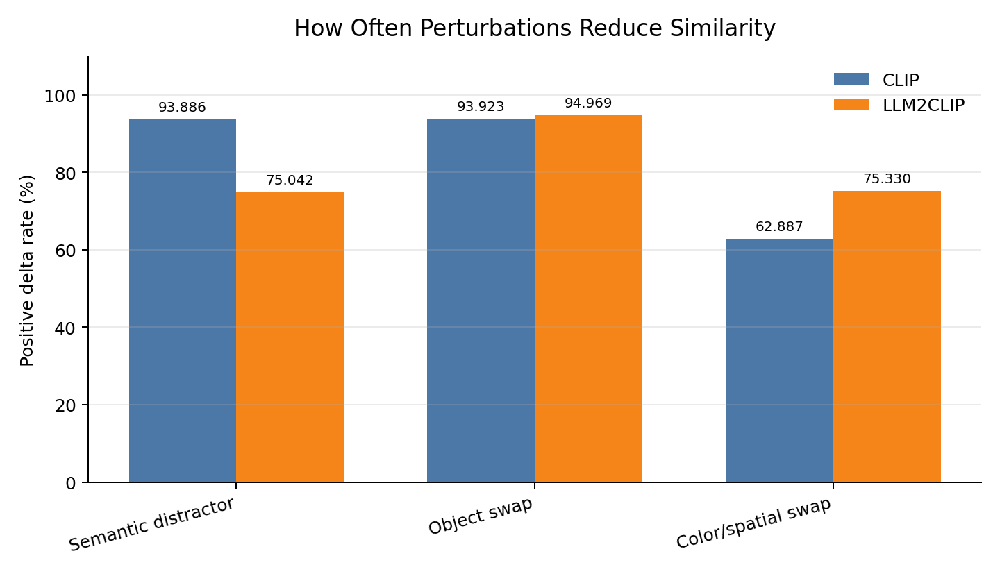
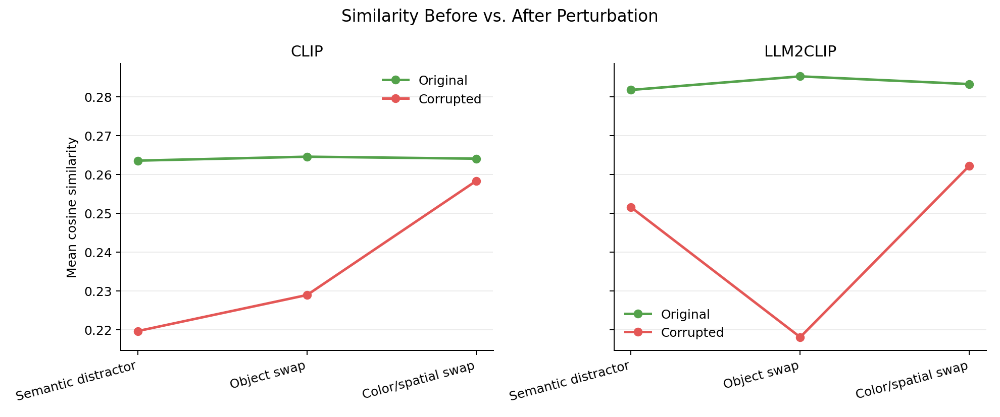

# Semantic Perturbation Report

## Setup

Models compared:

- CLIP: `openai/clip-vit-large-patch14-336`
- LLM2CLIP: `microsoft/LLM2CLIP-Openai-L-14-336` + `microsoft/LLM2CLIP-Llama-3-8B-Instruct-CC-Finetuned`

Dataset: MSCOCO 2014 5k image-text retrieval split. The metric for perturbation experiments is:

```text
delta = cosine(image_emb, text_emb(original_caption)) - cosine(image_emb, text_emb(corrupted_caption))
```

For object and color/spatial swaps, larger `delta` means the model is more sensitive to the semantic error. For semantic distractors, larger `delta` means the model is more affected by the additional unrelated description; lower `delta` means better robustness to that extra text.

## Figures









## Summary Table

| Model | Perturbation | n | s_original_mean | s_corrupted_mean | delta_mean | positive_rate |
|---|---:|---:|---:|---:|---:|---:|
| CLIP | Original | 25010 | 0.2635 |  |  |  |
| LLM2CLIP | Original | 25010 | 0.2817 |  |  |  |
| CLIP | Semantic distractor | 25010 | 0.2635 | 0.2196 | 0.0439 | 0.939 |
| LLM2CLIP | Semantic distractor | 25010 | 0.2817 | 0.2515 | 0.0302 | 0.750 |
| CLIP | Object swap | 14233 | 0.2645 | 0.2289 | 0.0356 | 0.939 |
| LLM2CLIP | Object swap | 14233 | 0.2852 | 0.2181 | 0.0671 | 0.950 |
| CLIP | Color/spatial swap | 18131 | 0.2640 | 0.2583 | 0.0057 | 0.629 |
| LLM2CLIP | Color/spatial swap | 18131 | 0.2832 | 0.2622 | 0.0210 | 0.753 |

## Findings

1. LLM2CLIP has higher original-caption similarity than CLIP: `0.2817` vs `0.2635`. This suggests stronger average alignment for clean image-caption pairs under this cosine setup.

2. LLM2CLIP is more sensitive to object swaps. Its mean delta is `0.0671`, compared with CLIP's `0.0356`, about `1.89x` larger.

3. LLM2CLIP is also more sensitive to color/spatial swaps. Its mean delta is `0.0210`, about `3.67x` CLIP's `0.0057`. The absolute delta is still much smaller than object swap, so fine-grained attribute/spatial reasoning remains harder.

4. Semantic distractors reveal a sensitivity/robustness tradeoff. LLM2CLIP's mean delta is `0.0302`, about `0.69x` CLIP's `0.0439`. Since this ratio is below 1.0, LLM2CLIP's similarity drops LESS under the distractor: it is more robust to the explicitly-labelled unrelated description, consistent with following the 'ignore'/'unrelated' instructions that CLIP's encoder cannot.

## Takeaway

LLM2CLIP improves semantic sensitivity and clean caption alignment, especially for object and attribute changes, while remaining more robust to explicitly-labelled distractor text — it better preserves the target caption similarity, consistent with following the natural-language instructions.
